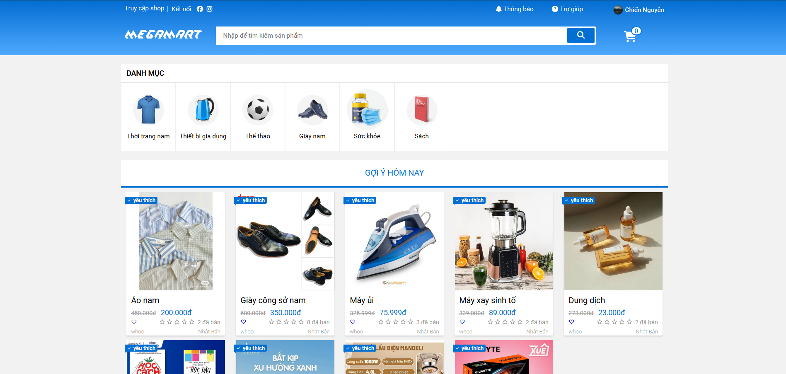
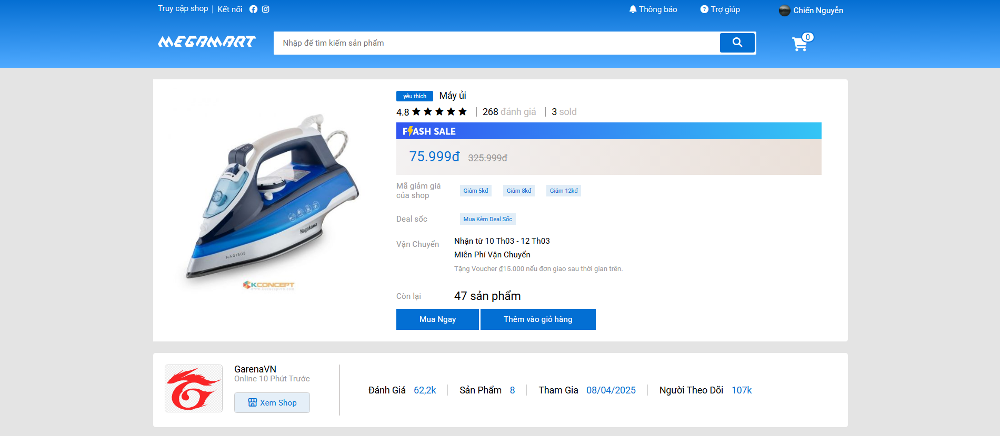
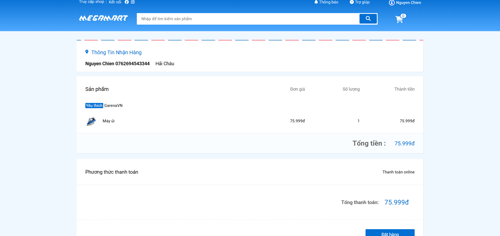
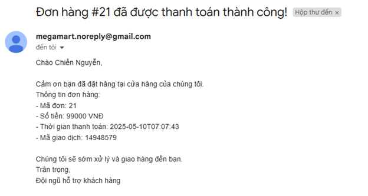
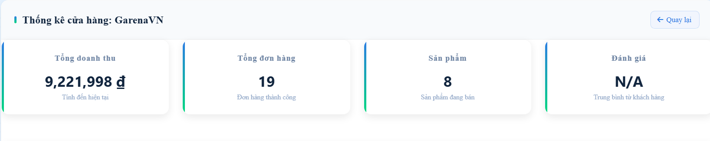
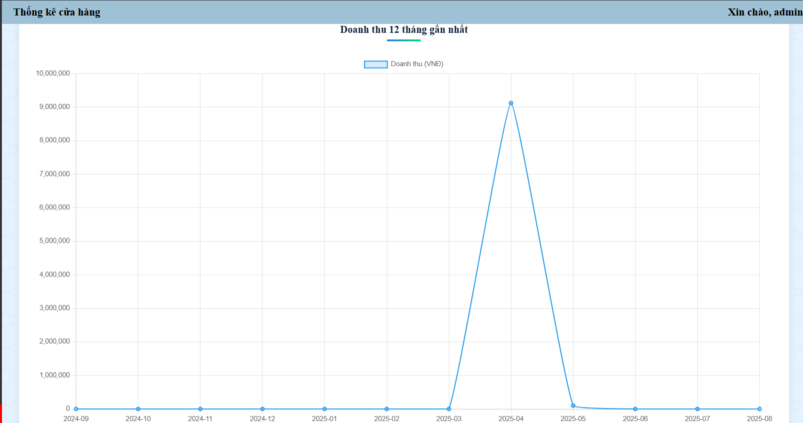
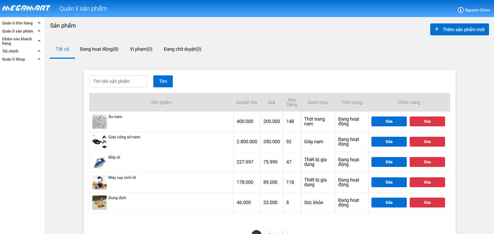
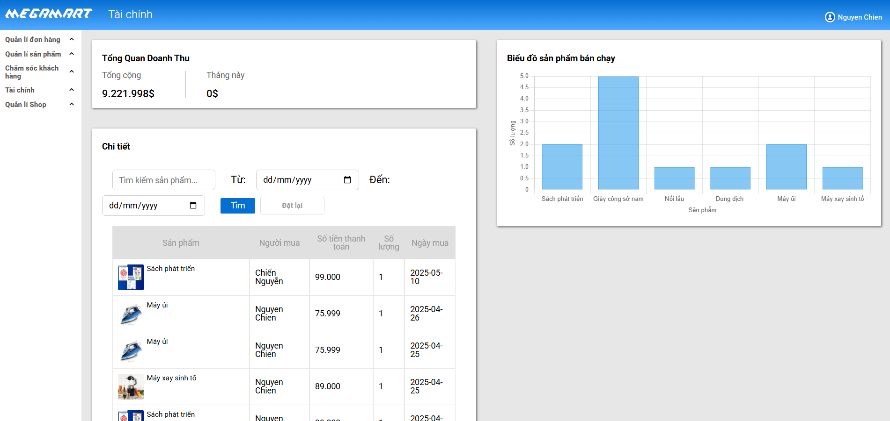

# 🛒 E-Commerce Website Project - PBL3

## 🔍 System Overview

This project is a simulation of an Amazon-like e-commerce website built using the Spring Framework (Java backend) and React (frontend). It was developed as part of our PBL3 project with a focus on clean API architecture, responsive UI, and practical user experience.

## 🌟 Key Features

- 🔐 User Authentication (Sign up, Login, Google OAuth)
- 🛍️ Product Browsing & Filtering by Categories
- 🧾 Shopping Cart and Order Management
- 📦 Dashboard for Product Management
- 📈 Analytics (Order statistics for Admin)

## 🖼️ UI/UX Screenshots

### 🏠 Home Page with Product Listing

### 📄 Product Detail View

### 🛒 Shopping Cart

### 🧑‍💼 Admin Dashboard
 

### Product Manager (Seller)

## 🚀 Technologies Used

- **Backend:** Java Spring MVC + Hibernate
- **Frontend:** HTML/CSS, Thymeleaf
- **Database:** MySQL
- **Tools:** Git, Figma (for UI design)

